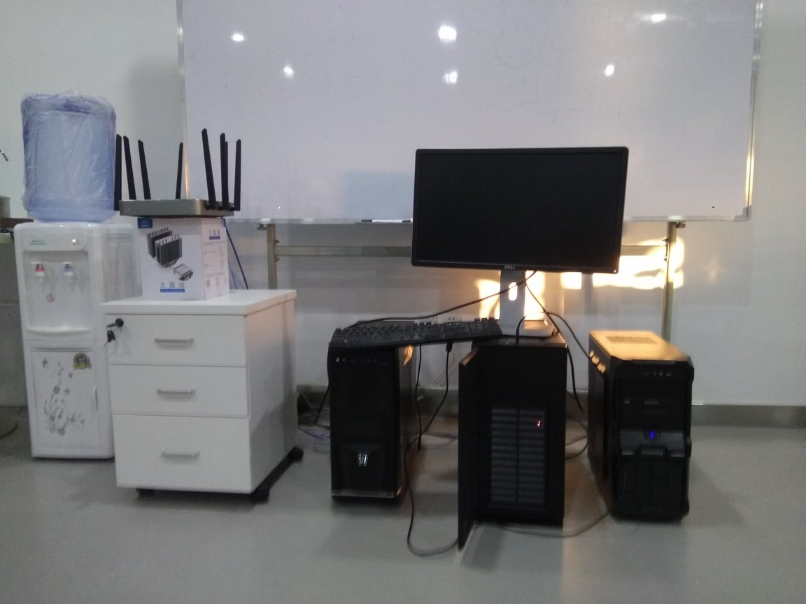
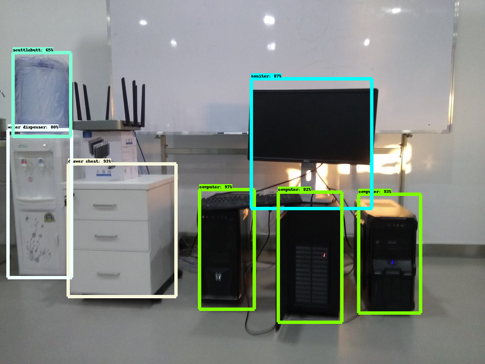

# 物体检测
#### 利用slim框架和object_detection框架，完成了一个物体检测的模型。

## 1 数据准备
从原始数据生成tfrecord格式的数据，通过tf.python_io.TFRecordWriter class把图像数据和标签写入到TFRecords文件。再从TFRecords文件中读取数据，使用 tf.TFRecordReader的tf.parse_single_example解析器将图像和标签解析出来，用于卷积网络的计算。

## 2 训练过程 
用TensorFlow框架下的object_detection模型对图片中的物体进行检测,用slim模型对物体进行分类。先对原始图片提取候选框，然后对区域大小归一化，把所有候选框缩放成固定大小，然后再特征提取，在特征层的基础上添加全连接层，再用SVM分类做识别，用线性回归来调整边框位置与大小，并对每个类别单独训练一个边框回归器，最后对检测出的物体进行标记。

## 3 验证结果
取任意一张训练集图片进行验证，得到的检测结果如下：    
原始图片

被检测到的物体及准确率

 